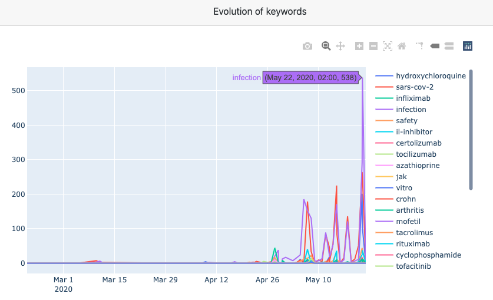
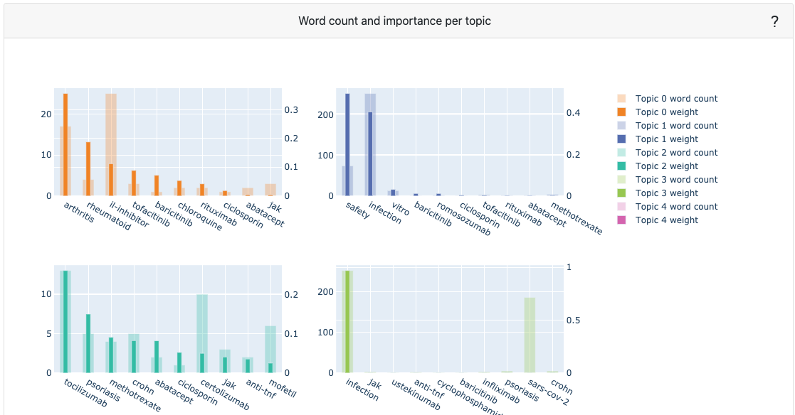
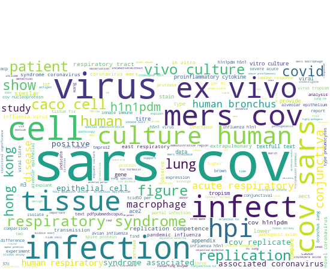
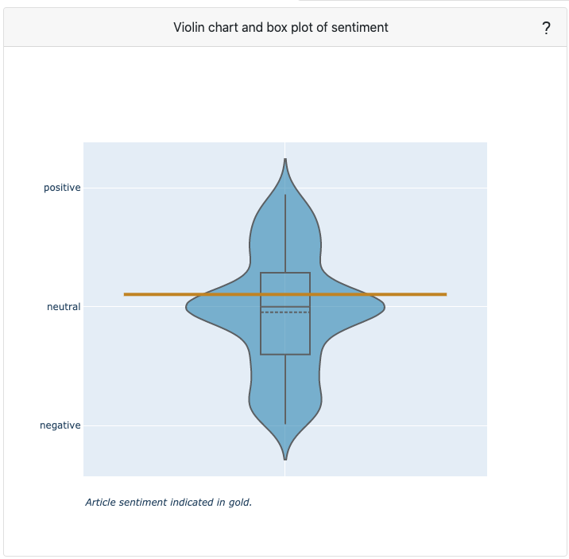
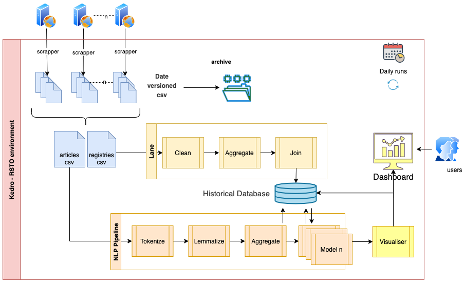

# COVID-19 Journals scraper and NLP Pipeline
This project is comprised of 2 parts: A scrap/NLP pipeline and a web application to show results.
The main motivation is to make easy to analyse scientific publications from different prestigious sources (scientific journals and websites) on a very novel topic: COVID-19
We then can show results on a website so any user can browse through results and find articles using keywords and other properties.
## 1 - Scrap and NLP Pipeline
The first part of the project is an ETL/Scrap pipeline built using [Kedro](https://github.com/quantumblacklabs/kedro), a python tool for creating simple pipelines.
It scraps covid-19 related Scientific papers and publications from different EMEA and worldwide sources/Journals, like:

- Lancet
- EMA
- ELSEVIER
- NEJM
- UPTODATE
- NATURE
- PUBMED

The pipeline has different nodes that:
1. Scraps websites using Beautifulsoup or API calls.
2. Creates Pandas Dataframes with article details.
3. Runs several NLP processes (Tokenization, Lemmatization, Sentiment, etc) .
4. Stores results in a SQLite DB to be used by the flask app on the dashboard website.

### Prerequisites
Dependencies are declared in `src/requirements.txt` for pip installation and `src/environment.yml` for conda installation.
To install them, run:
```
kedro install
```

### Running Kedro
You can run the Kedro project (Pipeline) with:
```
kedro run
```

### Demo dataset
To get an idea of the structure of the dataset that's created on the pipeline, you can look at:
[Primary Dataset](https://raw.githubusercontent.com/sansagara/ipvu_trends_dashboard/master/scrap/data/03_primary/articles/prm_articles.csv/2020-05-25T18.37.51.354Z/prm_articles.csv)

The SQLite DB that's used on the Flask visualizer is here:
[articles.db](https://github.com/sansagara/ipvu_trends_dashboard/blob/master/scrap/data/db/articles.db)

### Scrap node code
Scrap details can be seen on the scrap nodes here:
https://github.com/sansagara/ipvu_trends_dashboard/blob/master/scrap/src/ipvu_scrapper/scrap/nodes.py
Some nodes are scraped using `beautifulsoup`, while others like elsevier are accessed through a REST API.

### NLP Process node code
NLP processing can be seen on the process nodes here:
https://github.com/sansagara/ipvu_trends_dashboard/blob/master/scrap/src/ipvu_scrapper/process/nodes.py

### Keywords
Keywords, Stopwords and Stems for this project are all listed on the parameters file:
[Parameters.yml](https://github.com/sansagara/ipvu_trends_dashboard/blob/master/scrap/conf/base/parameters.yml)


## 2 - Flask Dashboard Application
This is a Flask application that displays a dashboard (Like the one on the Flask lesson)
It shows several charts and tables with different information like keyword frequency, sentiment, etc.

### Prerequisites
To install the flask app, you need:

- python3
- python packages in the requirements.txt file

Install the packages with
 `pip install -r requirements.txt`

### Running Flask
On a MacOS/linux system, installation is easy. 
Open a terminal, and go into the directory with the flask app files. 
Run `python visualize/myapp.py` in the terminal.

### Video Demo
Be sure to see my demo video on YouTube!
[Video Walkthrough](https://youtu.be/VzAYcjGuKsE)

### Deployed App
The flask application portion is deployed on Heroku for easy demoing purposes:
[App on Heroku](https://ipvu-dashboard.herokuapp.com/)


## Results
Results can be seen directly on the [App on Heroku](https://ipvu-dashboard.herokuapp.com/) or on the 
[Video Walkthrough](https://youtu.be/VzAYcjGuKsE).
Following is a reflection on how the results can be checked on the dashboard itself

### Visualizations 
As a mean to validate/see the results, several visualizations and charts are provided. Here's some explanation:

- An Histogram that shows the evolution of the different keywords. We can check manually the occurrence of them on the datasets.


- An LDA Topic model is retrained every time to detect topics on all articles scraped


- A wordcloud visualizes the top words occuring in the title and abstract of the article, whereby words which are more present are larger.


- A violin/boxplot chart of all article abstract available. A violin plot shows the distribution of article sentiments, while a boxplot visualizes how the quartiles and average are distributed. In gold, the current article's sentiment is visualized relative to all other articles. The extent to which an article abstract is positive, negative or neutral is determined by the words used (e.g. great vs. good) and punctuation (e.g. !). 


### LDA Model Code
LDA training with Gensim is done each time a request is made. The code can be seen on:
[LDA code](https://github.com/sansagara/ipvu_trends_dashboard/blob/master/visualize/controllers/topic_model.py)

### Conclusion
A case was made with a project that allows for simple, efficient exploration of the environment related to the topics of Covid-19 in the Pharma and Health landscape.
The results can then suggest publications for manual review to a team interested on a certain topic, sentiment or keyword.


### Future Improvements
- Scrap additional journals/sources.
- Use the content field with a pre-trained BERT model to recognize topics linked to the universe of interest.
- Train a ML model for Sentiment Analysis and Topic Detection that can learn and adapt whenever new batches of data.
- Customize the topics for Topic Analysis according to some business or research rules.
- Apply `A/B testing between Sources to check for bias or trends.


### Overall Solution Diagram
